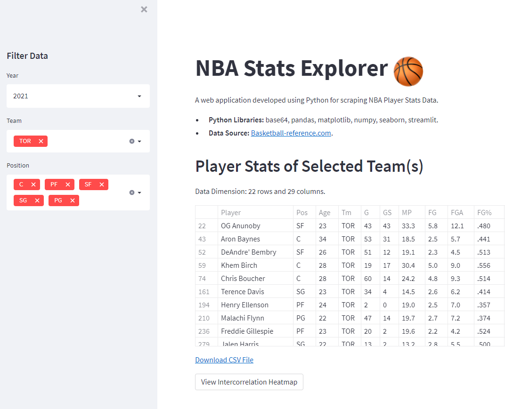

# NBA Stats App

A web app developed using **Python** and **Streamlit** for scraping NBA player stats through data filtering. Integrated with an intercorrelation heatmap to perform exploratory data analysis. 

Deployed using Heroku at https://nba-stats-explorer.herokuapp.com/.

